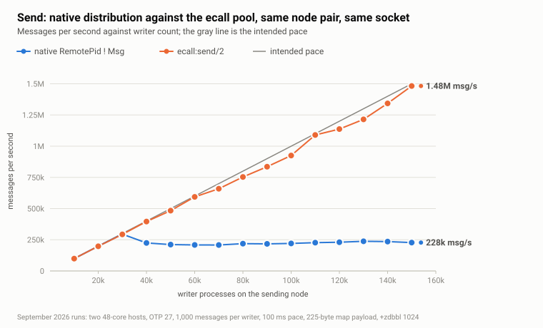

# ecall

Pooled, batched transport for Erlang distribution, with `send`, `cast` and `call` on top of it and a set of multi-node call and cast patterns (`call_one`, `call_any`, `call_all`, `call_all_wait`, `cast_one`, `cast_all`).

- [The problem](#the-problem)
- [What ecall does](#what-ecall-does)
- [Measurements](#measurements)
- [Installation and startup](#installation-and-startup)
- [Configuration](#configuration)
- [Node discovery and connections](#node-discovery-and-connections)
- [API](#api)
- [Semantics and limits](#semantics-and-limits)
- [Tests](#tests)

## The problem

OTP 25 fixed the many-to-one problem inside a node: many senders to one process used to serialize on the receiver's signal-queue lock, and the [parallel signal sending optimization](https://www.erlang.org/blog/parallel-signal-sending-optimization/) spread them over 64 buffers for `off_heap` processes.

Move the receivers to another node and a different single point takes over. Take N processes on node A, each sending to its own process on node B. At the application level there is no shared mailbox. At the transport level there is exactly one:

```text
node A                                                     node B

sender 1  ─┐                                            ┌─ receiver 1
sender 2  ─┤   one DistEntry, one output queue,         ├─ receiver 2
sender 3  ─┼─► one lock (dep->qlock), one port task ──► ┼─ receiver 3
   ...     │   one TCP socket, one input handler        │    ...
sender N  ─┘                                            └─ receiver N
```

Node A represents node B by a single `DistEntry`. Every `RemotePid ! Msg` encodes the message and appends it to that entry's output queue under the entry's lock (`dist_entry_out_queue` in `lcnt`). One port task drains the queue into one TCP socket, and one input handler on B parses every signal that arrives. Adding receivers on B adds nothing on A. The send path is in [dist.c](https://github.com/erlang/otp/blob/OTP-27.2.3/erts/emulator/beam/dist.c#L3510-L3606).

Measured on two 48-core hosts over 10 GbE, OTP 27.2.2: N writer processes on node A, one receiver process per writer on node B. Every writer sends 1,000 messages of 225 bytes, sleeping 100 ms between them, so the intended load is N × 10 messages per second and the ideal completion time is 100 seconds for any N. Nothing is dropped; a slow point is a long one.

| writers | intended msg/s | native `!` msg/s | `ecall:send` msg/s | ratio |
|--------:|---------------:|-----------------:|-------------------:|------:|
| 10,000 | 100,000 | 99,126 | 99,116 | 1.00 |
| 20,000 | 200,000 | 198,081 | 197,551 | 1.00 |
| 30,000 | 300,000 | 294,844 | 293,284 | 0.99 |
| 40,000 | 400,000 | 224,678 | 395,893 | 1.76 |
| 50,000 | 500,000 | 211,222 | 483,706 | 2.29 |
| 60,000 | 600,000 | 208,307 | 593,798 | 2.85 |
| 80,000 | 800,000 | 219,115 | 753,232 | 3.44 |
| 100,000 | 1,000,000 | 220,594 | 925,254 | 4.19 |
| 120,000 | 1,200,000 | 230,180 | 1,137,095 | 4.94 |
| 150,000 | 1,500,000 | 227,575 | 1,482,131 | 6.51 |



With plain `!` over distribution, the node delivers what is asked up to 30,000 writers. From 40,000 on, adding senders adds nothing: native throughput stays between 210,000 and 240,000 messages per second all the way to 150,000 writers, and the same fixed workload takes 659 seconds instead of 100. The knee at 30,000 to 40,000 writers is a property of this workload and hardware, not a constant of Erlang. The shape is. That plateau is the core problem ecall solves: with `ecall:send/2` the two paths are indistinguishable below the knee, and above it ecall keeps following the intended pace to the top of the sweep, finishing the same 150 million messages in 101 seconds.

The lock is a plain mutex and stays cheap on its own. What costs is the per-message work around it: every unbatched signal is sized, allocated and encoded by the sender, appended under the lock, and drained by the port task as a separate write. Once the encoded bytes waiting in the queue reach the distribution buffer busy limit (`+zdbbl`, 1 MiB by default), every sender takes the long path: append, see the busy flag, suspend itself, and later be resumed by the port task one by one. With a few processes on a slow link that is sensible flow control. With 100,000 processes the suspend-and-resume cycle becomes the workload.

The usual knobs do not change this:

- Raising `+zdbbl` changes the shape of the overload, not its size. The node alternates between long quiet stretches with every sender suspended and bursts where all of them wake at once. Throughput ends up the same, memory higher.
- `process_flag(async_dist, true)` removes the suspension and nothing else. Without flow control memory grows until the VM is killed, which the [documentation](https://www.erlang.org/doc/apps/erts/erlang.html#process_flag_async_dist) warns about.
- `erpc` is not the problem and not the fix. An `erpc:cast/4` or `erpc:call/4` travels through the same queue as a plain send, as a spawn request that is heavier on both ends.

The full analysis, with lock profiles and everything that was tried, is in [the article](docs/article.md).

## What ecall does

When a connection to the remote node exists, `ecall:send(To, Msg)` does not send to `To` from the caller. It hashes the caller's pid over a pool of local proxies and hands the request to one of them:

```erlang
pick_worker(#connection{size = Size, pool = Pool}) ->
  I = erlang:phash2(self(), Size),
  maps:get(I, Pool).

Proxy ! {do, {send, RemoteTo, Message}}
```

The proxy loop is the whole idea:

```erlang
worker_loop(Remote, BatchSize) ->
  erlang:garbage_collect(self()),
  Requests = collect_requests(0, BatchSize),
  catch Remote ! {batch, Requests},
  worker_loop(Remote, BatchSize).

collect_requests(0, BatchSize) ->
  receive
    {do, Request} -> [Request | collect_requests(1, BatchSize)]
  end;                                   % nothing waiting: block
collect_requests(Count, BatchSize) when Count < BatchSize ->
  receive
    {do, Request} -> [Request | collect_requests(Count + 1, BatchSize)]
  after
    0 -> []                              % mailbox empty: ship what we have
  end;
collect_requests(_Count, _BatchSize) ->
  [].                                    % batch cap reached
```

`Remote` is one worker of the receiver pool on the other node, paired with this proxy. It replays the batch locally: a `send` element becomes `To ! Message`, a `cast` element becomes `spawn(M, F, Args)`, and a `call` element becomes a spawned process that applies the function and sends the result back to the caller through the pooled channel in the opposite direction, so both legs are batched.

The principles, in the order they matter:

1. **Batch before the queue.** The distribution queue is entered once per batch instead of once per message: one encode, one lock acquisition, one append, one socket write, and the distribution header paid once. At 150,000 writers the same 150 million messages went over the wire as 25.4 GB instead of 33.8 GB.
2. **Pool both ends.** One batching process is a new single point on each side. The receiver pool defaults to the number of logical processors on the receiving node, and a connection creates one local proxy per remote worker. Callers are sharded onto proxies by pid, so the pool runs in parallel with no coordination.
3. **Never wait for a batch to fill.** The proxy blocks only when it has nothing at all. Once it has one request it takes whatever else is already in its mailbox and ships. At low load a batch holds one or two messages and the funnel costs one local hop. Under pressure the backlog grows, batches grow with it, and when a proxy is suspended on the busy limit its callers keep filling its mailbox, so it ships everything that accumulated as one batch on resume. The runtime's own backpressure is the batching clock. The batch cap is a safety valve, not an operating point.

## Measurements

Same hosts and workload as above for the other two operations: `erpc:cast/4` against `ecall:cast/4` and `erpc:call/4` against `ecall:call/4`. ecall ran with the defaults: pool 48, batch cap 1,000, `+zdbbl 1024`. For casts the cast function sends to a counter process on node B, so a point completes only when every cast has executed remotely. For calls each writer waits for its reply before sleeping.

### Cast

| writers | `erpc:cast` casts/s | `ecall:cast` casts/s | ratio |
|--------:|--------------------:|---------------------:|------:|
| 10,000 | 99,011 | 97,553 | 0.99 |
| 20,000 | 117,545 | 191,419 | 1.63 |
| 30,000 | 104,975 | 283,024 | 2.70 |
| 50,000 | 104,632 | 456,021 | 4.36 |
| 80,000 | 95,122 | 697,362 | 7.33 |
| 100,000 | 82,630 | 854,146 | 10.34 |
| 120,000 | 82,270 | 990,549 | 12.04 |
| 150,000 | 86,147 | 1,189,117 | 13.80 |

### Call

| writers | `erpc:call` calls/s | `ecall:call` calls/s | ratio |
|--------:|--------------------:|---------------------:|------:|
| 10,000 | 99,014 | 99,037 | 1.00 |
| 20,000 | 109,905 | 197,268 | 1.79 |
| 30,000 | 111,896 | 212,754 | 1.90 |
| 50,000 | 107,551 | 198,516 | 1.85 |
| 80,000 | 85,270 | 245,525 | 2.88 |
| 100,000 | 77,068 | 319,656 | 4.15 |
| 120,000 | 71,920 | 339,644 | 4.72 |
| 150,000 | 65,423 | 403,468 | 6.17 |


The native cast path is the worst of the three: it never scales past about 118,000 casts per second and declines from there, because an `erpc:cast` is a spawn request rather than a message. At 120,000 writers the same 120 million casts finished in 121 seconds through ecall instead of 1,459.

Calls are the hardest case for any transport, since every writer has one round trip in flight. Both paths peak far below send. ecall still delivers six times the calls per second at the top of the sweep, at 27 % of the intended pace where `erpc:call` is at 4 %.

### Resources at 150,000 writers

| operation | native peak memory | ecall peak memory | native scheduler busy | ecall scheduler busy | native max run queue | ecall max run queue |
|---|--:|--:|--:|--:|--:|--:|
| send | 34.2 GB | 3.2 GB | 87.0 % | 34.9 % | 76,206 | 1,185 |
| cast | 57.5 GB | 3.3 GB | 94.0 % | 44.7 % | 136,249 | 2,014 |
| call | 34.9 GB | 3.3 GB | 48.9 % | 21.7 % | 74,448 | 15,476 |

The ecall memory line is flat across the sweep, 2.3 GB at 10,000 writers and 3.3 GB at 150,000: it grows with the number of processes, not with the backlog. Scheduler time per million operations (`busy share × 48 schedulers × elapsed / millions of operations`):

| operation | native | ecall | ratio |
|---|--:|--:|--:|
| send | 184 s | 11 s | 16× |
| cast | 524 s | 18 s | 29× |
| call | 359 s | 26 s | 14× |

The network is not the limit in either case: at 150,000 writers the native send path wrote 51 MB/s to the distribution socket, ecall 251 MB/s, and the link carries about 1,250 MB/s.

## Installation and startup

Add ecall as a rebar3 dependency:

```erlang
{deps, [
  {ecall, {git, "https://github.com/vzroman/ecall.git", {branch, "main"}}}
]}.
```

ecall is an OTP application. The proper way to start it is to list it in your application's dependencies so that the release boot script, or `application:ensure_all_started/1`, starts it before your code runs:

```erlang
%% myapp.app.src
{application, myapp, [
  ...
  {applications, [kernel, stdlib, ecall]},
  ...
]}.
```

## Configuration

ecall reads two parameters from its application environment. In this repository they live in [config/apps/ecall.config](config/apps/ecall.config), which [config/sys.config](config/sys.config) includes:

```erlang
[
  {ecall, [
    {pool_size, undefined},
    {batch_size, 1000}
  ]}
].
```

In your own release put the same `{ecall, [...]}` entry into your `sys.config`.

**`pool_size`** is the number of worker processes in this node's receiver pool. It decides how many proxies every remote node creates for its connection to this node, because a connection has one proxy per remote worker. `undefined` (the default) means `erlang:system_info(logical_processors)` on this node. Read once when `ecall_receive` starts, so a change needs an application restart.

**`batch_size`** is the maximum number of requests a proxy on this node ships in one batch. It is a cap, not a target: a proxy ships whatever is waiting the moment it has anything. The cap bounds the size of a single distribution signal when a proxy resumes after a long suspension. The default is 1000. It is read when a connection is created.

## Node discovery and connections

ecall does not form the cluster. It relies on Erlang distribution being connected already, by `net_adm:ping/1`, `-connect_all`, a cluster library, or whatever you use. On top of that, nodes running ecall find each other through `pg`: the receiver pool on every node joins the group `nodes` in the `pg` scope `ecall`, and `ecall_pg_monitor` watches that group. When a member appears on another node, ecall opens a connection to it, fetching the remote pool's worker list and spawning one local proxy per remote worker. When the member leaves, because the remote ecall stopped or the distribution link dropped, the connection is closed and traffic to that node falls back to the native path until it rejoins. Each node does this independently, so a pair of nodes has a proxy pool in each direction.

`ecall:connection_info/1` shows the state of a connection from the calling node's point of view:

```erlang
1> ecall:connection_info('node_b@host').
{ok,#{status => connected,
      connection_pid => <0.245.0>,
      proxy_count => 48,
      batch_size => 1000}}
2> ecall:connection_info('unknown@host').
{error,not_connected}
```

## API

All functions live in the `ecall` module. `Node` is a node name, `Nodes` is a non-empty list of node names which may include the local node, and `Module`, `Function`, `Args` are the usual MFA triple.

### Single-node functions

These three are drop-in replacements for the native operations. If there is no ecall connection to the target node they call the native operation instead, so they are safe to use in a cluster where only some nodes run ecall.

#### `send(To, Message) -> Message`

Replaces `To ! Message`. `To` is a pid or a `{RegisteredName, Node}` tuple. A local destination is sent to directly. The function returns `Message`, like `!`.

```erlang
ecall:send(RemotePid, {update, Key, Value}),
ecall:send({my_server, 'node_b@host'}, {update, Key, Value}).
```

Use it wherever a process on one node sends to a process on another node from many processes at once: subscriptions, replication streams, event fan-out.

#### `cast(Node, Module, Function, Args) -> ok`

Replaces `erpc:cast/4`. The remote worker runs `spawn(Module, Function, Args)` and nobody waits for the result. Casts to the local node go through `erpc:cast/4`, which spawns locally.

```erlang
ok = ecall:cast('node_b@host', my_index, insert, [Key, Value]).
```

#### `call(Node, Module, Function, Args) -> {ok, Value} | {error, Reason}`

Replaces `erpc:call/4`. The remote worker spawns a process that runs `apply(Module, Function, Args)` and sends the result back through the pooled channel.

- If the function returns `{error, Reason}`, the call returns that `{error, Reason}` unchanged. Any other return value `Value` is wrapped as `{ok, Value}`.
- If the function raises, the call returns `{error, {exit, Reason}}`.
- If the connection to the node goes down while the call is in flight, the call returns `{error, {badrpc, Reason}}`. The caller monitors its proxy, and proxies die with the connection, so a call cannot hang on a dead node.
- With no connection, `erpc:call/4` is used and its error and exit exceptions are mapped to the same shapes; a `throw` comes back as `{error, Thrown}` on that path instead of `{error, {exit, Thrown}}`.

There is no timeout argument. A call waits until the function returns or the connection goes down, which is the behaviour of `erpc:call/4` with the default `infinity`.

```erlang
{ok, 42} = ecall:call('node_b@host', my_counter, value, [Key]),
{error, not_found} = ecall:call('node_b@host', my_index, lookup, [MissingKey]),
{error, {exit, badarith}} = ecall:call('node_b@host', erlang, '/', [1, 0]).
```

Note that a function returning `{ok, X}` produces `{ok, {ok, X}}`. The convention throughout ecall is that `{error, _}` means rejection and everything else means success.

### Group functions

The group functions apply the same MFA to a list of nodes with a policy about which nodes to use and how many answers to wait for. The called function follows the same convention: `{error, Reason}` is a rejection, any other value is a success. A node that cannot be reached, or on which the function crashed, yields `{badrpc, Reason}` as its error. By default such nodes are ignored, as if they were not in the list; the optional fifth argument `RpcErr = true` makes them count as ordinary errors, which is what you want when "unreachable" is itself a decision-relevant answer.

All of them return node-tagged results, `{Node, Value}`, so the caller knows which node answered.

#### `call_one(Nodes, M, F, As [, RpcErr]) -> {ok, {Node, Value}} | {error, [{Node, Reason}]} | {error, none_is_available}`

Try nodes one at a time until one succeeds. If the local node is in the list it is tried first; otherwise nodes are tried in random order. A node that answers `{error, Reason}` is recorded and the next node is tried. If every node fails, the accumulated errors are returned; with the default `RpcErr = false` and every node unreachable that list is empty, `{error, []}`. `none_is_available` is returned for an empty node list.

```erlang
case ecall:call_one(Replicas, my_store, read, [Key]) of
  {ok, {_Node, Value}} -> Value;
  {error, Errors} -> handle(Errors)
end.
```

Useful when the nodes are interchangeable and one answer is enough, and you want to load only one of them: reading from any replica of a record, looking up a value in a partitioned cache, asking one of several stateless workers to do a job. Preferring the local node makes the common case a local call. The cost is latency when the first choice fails, since attempts are sequential; if that matters, use `call_any`.

#### `call_any(Nodes, M, F, As [, RpcErr]) -> {ok, {Node, Value}} | {error, [{Node, Reason}]} | {error, none_is_available}`

Ask all nodes at the same time and take the first success. Other successes are discarded.

If the local node is in the list, it is called first and alone. If the local call succeeds, the same MFA is then **cast** to all the other nodes and the local result is returned without waiting for them. If the local call fails, the remaining nodes are called in parallel as above.

```erlang
{ok, {Node, Value}} = ecall:call_any(Replicas, my_store, read, [Key]).
```

Useful when latency matters more than load: the answer arrives as fast as the fastest node can produce it, at the cost of running the function everywhere. The local-first behaviour fits a write that must be applied on every replica but only needs the local acknowledgement: the local write is the confirmation, the remote writes proceed in the background. With `RpcErr = true` an unreachable node is an error and appears in the error list; with the default it is skipped.

#### `call_all(Nodes, M, F, As [, RpcErr]) -> {ok, [{Node, Value}]} | {error, {Node, Reason}} | {error, none_is_available}`

Ask all nodes in parallel and require every one of them to succeed. The first rejection ends the call with that node's error; results from the other nodes are discarded, though the function has already been started on them. If all nodes succeed, the results are returned in the order the replies arrived. Unreachable nodes are skipped by default; `none_is_available` means the list was empty or none of the nodes could be reached.

```erlang
case ecall:call_all(Replicas, my_store, prepare, [Txn]) of
  {ok, Results} -> commit(Results);
  {error, {Node, Reason}} -> abort(Node, Reason)
end.
```

Useful for operations that must hold everywhere or nowhere: the prepare phase of a two-phase commit, a schema change, a lock that must be taken on every node before proceeding, a consistency check that collects one value per node. Use `RpcErr = true` when a node that cannot be reached must veto the operation rather than be ignored.

#### `call_all_wait(Nodes, M, F, As) -> {Replies, Rejects}`

Ask all nodes in parallel and wait for every one of them, then return both lists: `Replies` is `[{Node, Value}]` for the nodes that succeeded, `Rejects` is `[{Node, Reason}]` for the nodes that answered `{error, Reason}` or were unreachable (`{badrpc, Reason}`). Nothing is treated as fatal, and each list is in the order the replies arrived. An empty node list returns `{[], []}`.

```erlang
{Replies, Rejects} = ecall:call_all_wait(nodes(), my_node, status, []),
[io:format("~p: ~p~n", [N, S]) || {N, S} <- Replies],
[io:format("~p failed: ~p~n", [N, R]) || {N, R} <- Rejects].
```

Useful when the caller wants the whole picture rather than a decision: gathering status or metrics from a cluster, a best-effort broadcast whose result is a report of who applied it, a cleanup that should run everywhere with failures logged rather than aborting the rest. It is the slowest policy because it always waits for the slowest node.

#### `cast_one(Nodes, M, F, As) -> ok`

Fire and forget at one node. If the local node is in the list it is chosen; otherwise a random node is. Returns immediately.

```erlang
ok = ecall:cast_one(Workers, my_jobs, run, [Job]).
```

Useful for distributing work that any one node can do, with no reply needed: pushing a job to one of a set of workers, spreading background tasks over a cluster. Preferring the local node keeps the work local when the caller is itself a worker node.

#### `cast_all(Nodes, M, F, As) -> ok`

Fire and forget at every node in the list, including the local one if present. Returns immediately.

```erlang
ok = ecall:cast_all(nodes(), my_cache, invalidate, [Key]).
```

Useful for broadcasts whose delivery does not need confirmation: cache invalidation, configuration reloads, notifying every node of an event, replicating a write where the caller does not wait for acknowledgement.

### `connection_info(Node) -> {ok, Map} | {error, not_connected}`

Reports whether this node has an ecall connection to `Node`, and its proxy count and batch size. See [Node discovery and connections](#node-discovery-and-connections).

### Summary

| function | nodes contacted | waits for | success | failure |
|---|---|---|---|---|
| `send/2` | one | nothing | `Message` | none reported |
| `cast/4` | one | nothing | `ok` | none reported |
| `call/4` | one | the reply | `{ok, Value}` | `{error, Reason}` |
| `call_one/4,5` | one at a time | first success | `{ok, {Node, Value}}` | `{error, [{Node, Reason}]}` |
| `call_any/4,5` | all in parallel | first success | `{ok, {Node, Value}}` | `{error, [{Node, Reason}]}` |
| `call_all/4,5` | all in parallel | all successes | `{ok, [{Node, Value}]}` | `{error, {Node, Reason}}` |
| `call_all_wait/4` | all in parallel | all replies | `{Replies, Rejects}` | never fails |
| `cast_one/4` | one | nothing | `ok` | none reported |
| `cast_all/4` | all | nothing | `ok` | none reported |

## Semantics and limits

- **Ordering is preserved per caller.** A caller always maps to the same proxy, a proxy emits batches in order, and the worker replays each batch in order. That is exactly Erlang's own guarantee: nothing is promised about the interleaving of different callers, and cast and call bodies run in independent processes with no ordering at all.
- **Backpressure moves.** A native remote send suspends the caller when the channel is busy. `ecall:send/2` and `ecall:cast/4` return as soon as the request is in a proxy's mailbox. The proxies are flow-controlled by the distribution layer; the callers are not. Under sustained overload with no application-level admission control, proxy mailboxes grow without bound. ecall raises the ceiling by an order of magnitude and gives you a place to put the policy; it does not remove the need for one.
- **Failure semantics match the native operations.** Send and cast are fire-and-forget on both paths. A call is protected by a monitor on its proxy and fails with `{error, {badrpc, Reason}}` when the connection goes down.

## Tests

The repository has two independent test layers: a fast unit suite that runs on one machine, and a distributed performance suite that drives two Docker-hosted nodes and produces the JSON behind the tables above.

```sh
make compile             # ./rebar3 compile
make test                # unit suite
make performance_tests   # distributed performance suite
make performance_report  # build and serve the report over the collected runs
make shell               # rebar3 shell with config/vm.args and config/sys.config
make clean_logs          # rm -rf logs
make clean_tests         # rm -rf _build/test, drops all collected runs
make clean_build         # rm -rf _build and rebar.lock
make clean_all           # clean_logs + clean_build
```

### Unit tests

```sh
make test
```


### Performance tests

```sh
make performance_tests
```

Compiles and then runs `./rebar3 ct --spec=./test/performance/test.spec`. The machine running this command is the *controller*: it does not generate load itself. It starts one sender node and one receiver node as `peer` nodes inside Docker containers, connects them, starts ecall on both, waits for the ecall pools to connect in both directions, and then drives every point of the matrix over Common Test.


#### Requirements

- Docker on the controller and on every host named in `role_config`, usable by the invoking user.
- The base image `erlang:27.2.2` in the local Docker image store. The suite never pulls: if it is missing the run fails with `{base_image_missing, ...}`, because the hosts these tests were written for have no registry access. Side-load it there (`docker save` / `docker load`) before the first run.
- For remote roles, `sshpass` and password SSH access for the user in `role_config`.
- Erlang distribution reachable between controller and both nodes. Containers run with `--network host`; the sender listens on port 4444 and the receiver on 4445, and both use a cookie the controller generates.

On each run the controller rebuilds the image `ecall-performance:otp27` from the working tree, so the nodes always run the code you have. Set `ECALL_PERFORMANCE_PREBUILT_IMAGE=true` to use the image already in the store instead. For a remote role the controller compares the image ID on the host with the local one and, if they differ, streams the image over SSH (`docker save | gzip | ssh … docker load`), which takes a few minutes the first time.

#### Configuring a run

Two files control everything. [test/performance/test.spec](test/performance/test.spec) selects which suites run — by default only `performance_send_SUITE`, with the other two commented out:

```erlang
{suites, 'PERFORMANCE_TEST', [
    performance_send_SUITE,
    performance_cast_SUITE,
    performance_call_SUITE
]}.
```

[test/performance/performance.config](test/performance/performance.config) holds three terms.

**`role_config`** says where the two nodes run. `local` puts the container on the controller machine, with the node named `sender@127.0.0.1` or `receiver@127.0.0.1`. A map puts it on another host over SSH, and then the node name is taken from the config, so it must match the host the container runs on:

```erlang
{role_config, #{
  sender => #{
    host => "rt-server1.fp",
    node => "sender@rt-server1.fp",
    user => "romanvozfp",
    password => "secret"
  },
  receiver => #{
    host => "rt-server2.fp",
    node => "receiver@rt-server2.fp",
    user => "romanvozfp",
    password => "secret"
  }
}}.
```

Note that `performance.config` is a plain file in the repository and the remote form keeps the SSH password in clear text; keep real credentials out of commits.

Both roles local is the quick way to check that a change runs at all; it measures loopback and two nodes competing for the same cores, not distribution. Everything in the tables above was measured with both roles remote, on two separate hosts.

**`performance`** is the workload matrix:

| key | meaning | default |
|---|---|---|
| `pace_ms` | pause between two operations of one writer, so the intended rate is `writer_count × 1000 / pace_ms` per second | 100 |
| `messages_per_writer` | operations per writer, and with `pace_ms` the ideal duration of a point | 1000 |
| `writer_counts` | one point per entry, per payload, per path | `[1000, 10000, 100000, 500000, 1000000]` |
| `payloads` | payload profiles, one sweep each | all five |

The payload profiles are defined in [test/performance/util/performance_payloads.erl](test/performance/util/performance_payloads.erl): `tiny` (one atom), `data` (a three-key map of ten-field maps, about 225 bytes encoded — the profile used for the tables above), and `binary_10kib`, `binary_100kib`, `binary_1mib`.

The defaults are the suite's, not the file's; the shipped file overrides them with the sweep used for the article. Keep the matrix small when trying things out — the run time is roughly `points × messages_per_writer × pace_ms`, doubled because every point is measured on both paths.

**`env_settings`** configures the two nodes:

| key | effect |
|---|---|
| `ecall_batch_size` | `batch_size` in the ecall application environment on both nodes, before ecall is started |
| `distribution_busy_limit_kib` | `+zdbbl` on both nodes |

```erlang
{env_settings, #{
  ecall_batch_size => 1000,
  distribution_busy_limit_kib => 1024
}}.
```

Both values are recorded in every result, and the report groups points by them, so runs with different settings stay separate instead of being averaged together.

The nodes also get `+P 134217727`, `+Q 1048576` and `+e 262144` so that the large writer counts fit, and the containers are started with `nofile=1048576`.

#### Running the controller from a container

For a controller host that cannot build images itself, [test/performance/controller.Dockerfile](test/performance/controller.Dockerfile) packages the controller, and [test/performance/run_offline_controller.sh](test/performance/run_offline_controller.sh) loads a pre-built image archive and runs it with the Docker socket, the config, the spec and the log directory mounted from `$ECALL_PERFORMANCE_ARTIFACT_DIR` (default `~/ecall_tests`), then restores log ownership to the invoking user.

### Performance report

```sh
make performance_report
```

| metric | source |
|---|---|
| throughput, msg/s | `writer_count × messages_per_writer / elapsed` |
| elapsed time, s | measured duration of the point |
| maximum memory, GB | peak total memory on the receiver node |
| scheduler utilization, % | receiver node, sampled over the point |
| max run queue | longest run queue seen on the receiver node |
| network, MB/s | distribution socket bytes over elapsed |
| average packet, B | distribution socket bytes per packet |

## License

MIT. See [LICENSE](LICENSE).
