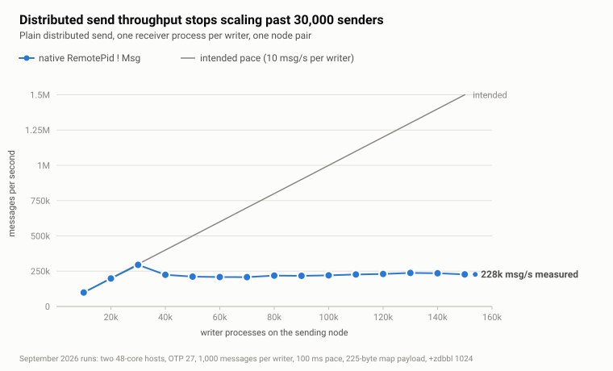

# The many-to-one problem, one hop further: distributed Erlang under 150,000 senders

*OTP 25 fixed the lock that many local senders used to fight over. Send the same traffic to another node and a different single point takes its place: one distribution queue per node pair. This is the story of how a SCADA system ran into it, what it looks like in numbers, and what we built to get past it.*

## The problem we all know: many senders, one process

In 2021 Kjell Winblad described the [parallel signal sending optimization](https://www.erlang.org/blog/parallel-signal-sending-optimization/) that shipped in OTP 25. The post starts from first principles: "All concurrently executing entities (processes, ports, etc.) in an Erlang system communicate using asynchronous signals." Then it states the guarantee that makes the optimization possible: "The only signal ordering guarantee given is the following: if an entity sends multiple signals to the same destination entity, the order is preserved."

Before OTP 25, every sender to a process appended to that process's outer signal queue under one lock, and "this lock can become a scalability bottleneck and a contended hot-spot when there are enough parallel senders." The fix hashes each sender onto one of 64 buffer slots, each with its own lock, so senders that are different entities stop synchronizing with each other. The receiver drains the slots in bulk. The buffers are installed only when a contention counter says they are needed, and only for processes running with `{message_queue_data, off_heap}`. In the post's benchmark, receive throughput with 16 senders is 520 times better with the optimization.

Three ideas from that post carry over to everything below:

1. The ordering guarantee is per sender-receiver pair. Different senders never needed to be serialized against each other.
2. The cure for a hot enqueue point is fewer contenders per lock, not a faster lock.
3. A receiver that drains in bulk is cheaper than one that pays for every message separately.

## The problem we know less well: many senders, one remote node

Now move the receivers to another node. Take 100,000 processes on node A, each sending to its own process on node B. At the application level there is no shared mailbox anywhere. At the transport level there is exactly one:

```text
node A                                                     node B

sender 1  ─┐                                            ┌─ receiver 1
sender 2  ─┤   one DistEntry, one output queue,         ├─ receiver 2
sender 3  ─┼─► one lock (dep->qlock), one port task ──► ┼─ receiver 3
   ...     │   one TCP socket, one input handler        │    ...
sender N  ─┘                                            └─ receiver N
```

With standard distribution, node A represents node B by a single `DistEntry`. Every `RemotePid ! Msg` encodes the message and then appends the encoded buffers to that entry's output queue under the entry's queue lock. One port task drains the queue into one TCP socket. On node B, one input handler parses every signal that arrives on that socket and routes it to its receiver. Adding receivers on B adds nothing on A. The structures are in [erl_node_tables.h](https://github.com/erlang/otp/blob/OTP-27.2.3/erts/emulator/beam/erl_node_tables.h) and the send path in [dist.c](https://github.com/erlang/otp/blob/OTP-27.2.3/erts/emulator/beam/dist.c#L3510-L3606). If you run the lock profiler `lcnt` on such a node, the lock is listed as `dist_entry_out_queue`.

So the application topology can be many-to-many, and the transport is still many-to-one.

### What that looks like in numbers

We measured plain distributed sends between two identical hosts: two Xeon Gold 6342 sockets each, 48 cores with hyper-threading off, 251 GiB of RAM, a 10 GbE bond between them, Ubuntu 22.04. Each node runs in a Docker container with host networking from the official `erlang:27.2.2` image, stock emulator, default `+zdbbl 1024`. A third machine drives the run through Common Test.

The workload: N writer processes on node A, N receiver processes on node B, one receiver per writer. Every writer sends 1,000 messages and sleeps 100 ms between them, so the intended load is N × 10 messages per second and the ideal completion time is 100 seconds whatever N is. The message is a nested map (three sub-maps of ten atom fields each), 225 bytes on the wire. N goes from 10,000 to 150,000 in steps of 10,000. A point ends when the receivers have counted every expected message; nothing is dropped, a slow point is only a long one. Throughput is `N × 1000 / elapsed seconds`, where elapsed is the mean of each receiver's first-to-last message span.

| writers | intended msg/s | measured msg/s | elapsed | peak memory | max run queue | scheduler busy |
|--------:|---------------:|---------------:|--------:|------------:|--------------:|---------------:|
| 10,000 | 100,000 | 99,126 | 101 s | 2.2 GB | 454 | 4.6 % |
| 20,000 | 200,000 | 198,081 | 101 s | 3.7 GB | 3,686 | 6.9 % |
| 30,000 | 300,000 | 294,844 | 102 s | 9.3 GB | 16,289 | 21.9 % |
| 40,000 | 400,000 | 224,678 | 178 s | 11.5 GB | 22,304 | 83.7 % |
| 50,000 | 500,000 | 211,222 | 237 s | 14.6 GB | 25,440 | 88.1 % |
| 60,000 | 600,000 | 208,307 | 288 s | 15.8 GB | 35,302 | 87.9 % |
| 80,000 | 800,000 | 219,115 | 365 s | 21.6 GB | 32,983 | 82.8 % |
| 100,000 | 1,000,000 | 220,594 | 453 s | 24.3 GB | 46,786 | 84.1 % |
| 120,000 | 1,200,000 | 230,180 | 521 s | 29.9 GB | 63,562 | 82.0 % |
| 150,000 | 1,500,000 | 227,575 | 659 s | 34.2 GB | 76,206 | 87.0 % |



Up to 30,000 writers the node delivers what is asked of it. At 40,000 it delivers less than at 30,000. From there on, adding senders adds nothing: the plateau sits between 210,000 and 240,000 messages per second all the way to 150,000 writers, while the time to complete the fixed workload grows from 100 seconds to 11 minutes, the sender's memory grows to 34 GB, and the run queues peak at tens of thousands of processes waiting for a scheduler. Peak memory here is `erlang:memory(total)` on the sender; about 2.2 GB of it is the process table for the harness's large `+P` setting and is present in every point. "Scheduler busy" is the share of scheduler wall time not spent idle, which on this path also counts time schedulers spend blocked in the distribution machinery.

### Why more processes rather than a faster loop

We could have taken a handful of processes and made them send as fast as possible. We chose to raise the number of processes and keep each one slow, because that is what a real system looks like. A process in our system owns a device, a subscription, or a calculation; it sends a message when it has something to say and does useful work in between. Load arrives as population, not as one tight loop. Sizing the test this way also exercises the parts of the runtime that matter at scale: scheduling tens of thousands of runnable processes, and flow control that has to suspend and resume every one of them.

## How we ran into it

We built a SCADA/EMS system for a national electricity grid operator that processes hundreds of thousands of signals per second. A signal arriving on one node is not done when it is written locally: it also goes to neighbouring nodes, where it is fanned out to subscribers, fed into further calculations, and stored in the database.

At a certain load the system started to degrade, and not gracefully. Remote messaging slowed down first, but soon the whole VM was barely responsive. The investigation pointed at `erpc:cast/4`, which carried the inter-node traffic: it was consuming almost all the resources of the node. Our first thought was that `erpc` itself was the problem. Looking deeper showed that `erpc` was only using the same transport as everything else. Every message between two nodes, whether a plain send or an `erpc` spawn request, passes through the same distribution queue, and that queue was where the contention was.

The pattern resembled the many-to-one problem from Winblad's post, but it had a different shape.

### Same shape, different lock

When many local senders saturate an `on_heap` process, the node goes quiet. The scheduler statistics report the schedulers as busy, but the operating system shows one or two cores in use out of 48, because the schedulers are parked in the kernel waiting for a lock. In our distributed overload the opposite happened: `top` showed the BEAM at more than 4,600 % on a 48-core box. Every core was working, and almost nothing useful was getting done.

The difference comes from the locks. A process's signal-queue lock is an ERTS process lock, and it does not allow barging: when it is released with a waiter queued, ownership is handed to the first waiter, which then has to be woken and scheduled before anything else can proceed. Under heavy fan-in that turns every enqueue into a wake-up, and throughput falls to the wake-and-dispatch rate. The distribution queue lock is a plain pthread mutex. It does allow barging: a running thread takes it the moment it is released, so the lock itself stays cheap even when almost every acquisition collides. We saw both regimes on the same box: 10,000 paced senders reached 12 % of their pace against one local `on_heap` process, and 99 % against a process on a second node over loopback. The distributed path does not collapse. It saturates.

What is expensive on the distributed path is not holding the mutex. It is the enqueue mechanics around it. Every unbatched signal is sized, allocated and encoded by the sending process, appended under the lock with the queue accounting updated, and then drained by the port task as a separate write. The cost is paid once per message, and it is paid by scheduler threads that could otherwise run your application.

### The long path

The enqueue path gets much longer once the queue is saturated. The distribution buffer busy limit, `+zdbbl`, is 1 MiB by default. When the encoded bytes waiting in the output queue reach it, the queue is flagged busy and every sender that arrives after that takes the long way round:

1. Append the encoded message under the queue lock, then see the busy flag and release the lock.
2. Allocate a list entry for itself and suspend itself, which means taking its own status lock and leaving the run queue.
3. Take the queue lock a second time to check whether the queue is still busy, and if it is, append itself to the entry's list of suspended processes. If the queue emptied in between, resume immediately, but still yield the scheduler as if it had been suspended.
4. Later, after the port task has written the queued buffers to the socket and the queue has dropped below the limit, the port task detaches the whole suspended list and resumes every process in it, one after another: process lookup, status lock, state update, run-queue insertion, list entry release.

All of that is at [dist.c](https://github.com/erlang/otp/blob/OTP-27.2.3/erts/emulator/beam/dist.c#L3549-L3606) and its drain counterpart a few hundred lines [further down](https://github.com/erlang/otp/blob/OTP-27.2.3/erts/emulator/beam/dist.c#L4023-L4037). It is a sensible design for a few processes hitting a slow link. With 100,000 processes it becomes the workload. Each cycle suspends and resumes a herd, the herd refills the queue in a few milliseconds, and the cycle repeats. That is where the 4,600 % went: encoding, suspending, resuming, and scheduling a herd, tens of times per second.

### What we tried first

We raised `+zdbbl`. The [documentation](https://www.erlang.org/doc/apps/erts/erl_cmd.html) says "a higher limit gives lower latency and higher throughput at the expense of higher memory use", and that is what a knowledgeable colleague suggests first. It changed the shape of the overload, not its size. With a huge limit the node alternates between long quiet stretches with every writer suspended and bursts where all of them wake at once: a saw-tooth on the CPU graph with a period of tens of seconds, and memory climbing with every cycle. Throughput at the end was the same.

We tried `process_flag(async_dist, true)`, which makes senders never block on the busy limit. The [documentation](https://www.erlang.org/doc/apps/erts/erlang.html#process_flag_async_dist) is candid about it: no flow control is enforced, and "unlimited signaling with `async_dist` enabled in the absence of flow control will typically cause the sending runtime system to crash on an out of memory condition." That is what we got: memory grew until the VM was killed. Removing the suspension removes nothing from the per-message work; it only removes the brake.

### Batching, then a pool, then ecall

Then we tried the approach from Roberto Ostinelli's 2009 post [Boost message passing between Erlang nodes](https://www.ostinelli.net/boost-message-passing-between-erlang-nodes/): a router process per node that accumulates messages for a remote node and forwards them in one go. He measured 5.3 million messages per minute inside a node against 700,000 between nodes, and batching took the remote figure to 2.1 million. His router flushed on a queue size or a 200 ms timer. We kept the batching and dropped the timer: the router shipped whatever it had, immediately.

That gave good results, and it was still not enough. One process sends on one scheduler. At a certain load it could no longer keep up with what the writers were pushing into its mailbox, and the mailbox started to grow. So we replaced the single router with a pool of senders on one side and a pool of receivers on the other. That solution satisfied our demand.

Which brought us back to the original problem. Our traffic was `erpc:cast`, and there was no way to make `erpc` travel through our transport. So we implemented `ecall`: the pooled, batched transport, with `cast` and `call` built on it as different kinds of batch elements. It solved our problem. Then we built the multi-node call and cast patterns that a distributed system needs, `call_one`, `call_any`, `call_all`, `call_all_wait`, `cast_one`, `cast_all`, on top of it.

## What ecall does

The library is small. When a connection to a remote node exists, `ecall:send(To, Msg)` does not send to `To` from the caller. It picks a local proxy by hashing the caller's pid over the pool and hands the request to it:

```erlang
pick_worker(#connection{size = Size, pool = Pool}) ->
  I = erlang:phash2(self(), Size),
  maps:get(I, Pool).

Proxy ! {do, {send, RemoteTo, Message}}
```

The proxy loop is the whole idea in a dozen lines:

```erlang
worker_loop(Remote, BatchSize) ->
  erlang:garbage_collect(self()),
  Requests = collect_requests(0, BatchSize),
  catch Remote ! {batch, Requests},
  worker_loop(Remote, BatchSize).

collect_requests(0, BatchSize) ->
  receive
    {do, Request} -> [Request | collect_requests(1, BatchSize)]
  end;                                   % nothing waiting: block
collect_requests(Count, BatchSize) when Count < BatchSize ->
  receive
    {do, Request} -> [Request | collect_requests(Count + 1, BatchSize)]
  after
    0 -> []                              % mailbox empty: ship what we have
  end;
collect_requests(_Count, _BatchSize) ->
  [].                                    % batch cap reached
```

`Remote` is one worker of the receiver pool on the other node, paired with this proxy. It replays the batch locally:

```erlang
handle_batch([{send, To, Message} | Rest], State) ->
  catch To ! Message,
  handle_batch(Rest, State);
handle_batch([{cast, Module, Function, Args} | Rest], State) ->
  spawn(Module, Function, Args),
  handle_batch(Rest, State);
handle_batch([{call, Ref, ClientPid, Module, Function, Args} | Rest], State) ->
  spawn(fun() ->
    try
      Result = apply(Module, Function, Args),
      ecall_connection:send(ClientPid, {Ref, Result})
    catch
      _:Reason -> ecall_connection:send(ClientPid, {'DOWN', Ref, Reason})
    end
  end),
  handle_batch(Rest, State);
handle_batch([], State) ->
  State.
```

The principles behind it, in the order they mattered to us:

### 1. Batching: fewer enqueues, more messages per enqueue

The distribution queue is entered once per batch instead of once per message. A batch of 20 messages pays for one encode of a top-level signal, one lock acquisition, one queue append and one socket write. This is Ostinelli's principle taken further: no timer, a pool instead of one router, and the batch used for more than plain sends. It also costs fewer bytes: the distribution header and control message are paid once per batch, so at 150,000 writers the same 150 million messages went over the wire as 25.4 GB instead of 33.8 GB, 170 bytes per message instead of 225.

### 2. A pool of senders and receivers instead of one process

One batching process is a new single point, on both ends: one process collecting and encoding batches, one process decoding them and doing the local deliveries. A pool spreads that work over the cores. The receiver pool defaults to `erlang:system_info(logical_processors)` on the receiving node, 48 on our hosts, and a connection creates one local proxy per remote worker. Callers are sharded onto proxies by pid, so the whole pool works in parallel with no coordination between its members.

We swept the pool size in an earlier series of runs on the same hosts, up to 400,000 writers. A pool of one never stalled but saturated badly: 14 % of the intended pace and 69 GB of sender memory at 400,000 writers. A pool of 8 held to about 150,000 writers and fell off after that. Pools of 24 and 48 were flat across the whole range. There is a trade-off: more proxies means more contenders on the distribution lock, fewer means more contention on each proxy's mailbox. On a 48-core box anything in the tens works.

### 3. Self-balancing batching: bigger batches are cheaper, and more backpressure makes bigger batches

The `after 0` is the important line. The proxy never waits for a batch to fill. It blocks only when it has nothing at all; once it has one request, it takes whatever else is already in its mailbox and ships. So the batch size is not a configured number. It is the current backlog.

At low load the mailbox is nearly always empty, a batch holds one or two messages, and the cost of the funnel is one local hop. Under pressure the backlog grows, batches grow with it, and each distribution enqueue carries more messages. Backpressure from the distribution layer feeds the same loop: when a proxy is suspended on the busy limit, its callers keep filling its mailbox, and when it resumes it ships everything that accumulated as one batch. The busy limit is the batching clock. This is why we leave `+zdbbl` at its default for the pooled path; raising it in our earlier runs only made the batches smaller and the memory larger.

The socket counters show the balancing at work. Average bytes per distribution socket write, send test:

| writers | native | ecall |
|--------:|-------:|------:|
| 10,000 | 225 B | 456 B |
| 40,000 | 225 B | 506 B |
| 50,000 | 225 B | 748 B |
| 80,000 | 225 B | 1,394 B |
| 100,000 | 225 B | 1,883 B |
| 120,000 | 225 B | 2,444 B |
| 150,000 | 225 B | 3,429 B |

Native is one message per write by construction. ecall grows from about two messages per write to about twenty, while its throughput stays at the intended pace. The batch cap of 1,000 is far above anything these runs produced. It exists as a safety valve, not as an operating point.

### 4. `{message_queue_data, off_heap}` for the pools

A proxy's job is to hold a backlog, and that decides how its mailbox should be stored. With the default `on_heap`, queued messages end up on the process heap and every garbage collection walks them. A proxy sitting on thousands of queued requests pays for all of them at each collection, and the price grows with the backlog. With `off_heap` the queue lives outside the heap and is never part of a collection. The [process_flag documentation](https://www.erlang.org/doc/apps/erts/erlang.html#process_flag_message_queue_data) says the same: `off_heap` is recommended for a process that "may potentially accumulate a large number of messages in its queue", because collecting a heap that holds them "can become extremely expensive". Both pools are therefore spawned with:

```erlang
spawn_opt(fun() -> worker_loop(Remote, BatchSize) end,
          [link, {message_queue_data, off_heap}])
```

The explicit `garbage_collect/1` at the top of the proxy loop is the other half of it. It runs at the one moment the proxy holds nothing, so it is nearly free, and it releases the batch that was just sent.

Contention on the proxy mailboxes is a smaller concern than it looks. The hop from 150,000 writers into 48 proxies is a many-to-one send on paper, but only scheduler threads write, there are 48 of them on this box, and they are sharded over 48 mailboxes: at any instant that is about one writer per mailbox. The OTP 25 signal-queue buffers from Winblad's post, which come with the `off_heap` flag, are additional protection for the case where the pool is much narrower than the scheduler count. Our earlier pool-size runs show where that matters: a pool of one with `off_heap` proxies completed 100,000 writers in 313 seconds, and the same point with the flag switched to `on_heap` did not complete at all, one core busy out of 48 and 107 of 112 VM threads parked in the kernel. With a pool the size of the scheduler count that protection is rarely exercised. The garbage-collection saving is what you get every day.

### 5. Casts and calls over the same transport

A batch element is a tagged tuple, so `cast` and `call` cost the transport nothing extra. A cast becomes a `spawn/3` on the remote worker; a call becomes a spawned process that applies the function and sends the result back to the caller through the pooled channel in the opposite direction, so both legs are batched. If no ecall connection exists for the target node, the calls fall back to `!`, `erpc:cast/4` and `erpc:call/4`. Nodes running ecall find each other through a `pg` group and connect automatically. Failure semantics match the native operations: send and cast are fire-and-forget on both paths, and a call monitors its proxy, which is linked to the connection and exits when the connection to the node goes down, so the caller gets `{error, {badrpc, Reason}}` instead of waiting forever.

```erlang
ecall:send(RemotePid, Msg),                               % instead of RemotePid ! Msg
ok = ecall:cast(Node, Module, Function, Args),            % instead of erpc:cast/4
{ok, Result} = ecall:call(Node, Module, Function, Args).  % instead of erpc:call/4
```

### 6. Multi-node patterns

Replication and lookup need policies about which nodes and how many answers, so those sit on top:

| API | policy |
|---|---|
| `cast_one(Nodes, M, F, As)` | fire and forget at one node, the local node if it is in the list |
| `cast_all(Nodes, M, F, As)` | fire and forget at every node |
| `call_one(Nodes, M, F, As)` | try nodes one at a time until one answers `{ok, _}` |
| `call_any(Nodes, M, F, As)` | ask all nodes in parallel, take the first `{ok, _}` |
| `call_all(Nodes, M, F, As)` | require every node to answer `{ok, _}` |
| `call_all_wait(Nodes, M, F, As)` | collect both the replies and the rejects |

A called function returns `{ok, Result}` or `{error, Reason}`; the group functions decide what to do with each answer. Nodes that are unreachable come back as `{badrpc, Reason}`, ignored by default and treated as errors with the optional fifth argument. That is the vocabulary a distributed database needs: write to all, read from any, fall back on error.

## The numbers

Same hosts, same matrix, three operations measured in September 2026: `!` against `ecall:send/2`, `erpc:cast/4` against `ecall:cast/4`, and `erpc:call/4` against `ecall:call/4`. The ecall path ran with the defaults: a pool of 48, batch cap 1,000, `+zdbbl 1024`. For casts, the cast function is `erlang:send` to a counter process on node B, so a point completes only when every cast has executed remotely. For calls, each writer waits for its reply before sleeping, so a slow reply stretches that writer's cycle. Elapsed for cast and call is wall time from releasing the writers to verified completion.

Send:

| writers | native `!` msg/s | `ecall:send` msg/s | ratio |
|--------:|-----------------:|-------------------:|------:|
| 10,000 | 99,126 | 99,116 | 1.00 |
| 20,000 | 198,081 | 197,551 | 1.00 |
| 30,000 | 294,844 | 293,284 | 0.99 |
| 40,000 | 224,678 | 395,893 | 1.76 |
| 50,000 | 211,222 | 483,706 | 2.29 |
| 60,000 | 208,307 | 593,798 | 2.85 |
| 80,000 | 219,115 | 753,232 | 3.44 |
| 100,000 | 220,594 | 925,254 | 4.19 |
| 120,000 | 230,180 | 1,137,095 | 4.94 |
| 150,000 | 227,575 | 1,482,131 | 6.51 |


Below the knee the two paths are indistinguishable: the funnel costs nothing measurable. Above it, ecall keeps following the intended pace, 98.8 % of it at 150,000 writers, which means the test's own pacing was the limit at the top of the sweep, not the transport. The same 150 million messages took 659 seconds natively and 101 seconds through the pool.

Cast:

| writers | `erpc:cast` casts/s | `ecall:cast` casts/s | ratio |
|--------:|--------------------:|---------------------:|------:|
| 10,000 | 99,011 | 97,553 | 0.99 |
| 20,000 | 117,545 | 191,419 | 1.63 |
| 30,000 | 104,975 | 283,024 | 2.70 |
| 50,000 | 104,632 | 456,021 | 4.36 |
| 80,000 | 95,122 | 697,362 | 7.33 |
| 100,000 | 82,630 | 854,146 | 10.34 |
| 120,000 | 82,270 | 990,549 | 12.04 |
| 150,000 | 86,147 | 1,189,117 | 13.80 |

Call:

| writers | `erpc:call` calls/s | `ecall:call` calls/s | ratio |
|--------:|--------------------:|---------------------:|------:|
| 10,000 | 99,014 | 99,037 | 1.00 |
| 20,000 | 109,905 | 197,268 | 1.79 |
| 30,000 | 111,896 | 212,754 | 1.90 |
| 50,000 | 107,551 | 198,516 | 1.85 |
| 80,000 | 85,270 | 245,525 | 2.88 |
| 100,000 | 77,068 | 319,656 | 4.15 |
| 120,000 | 71,920 | 339,644 | 4.72 |
| 150,000 | 65,423 | 403,468 | 6.17 |


This is the production symptom, reproduced. The native cast path is the worst of the three: it never scales past about 118,000 casts per second and declines from there, because an `erpc:cast` is not a message but a spawn request, which is heavier on both ends of the channel. The pooled path carries a batch of casts as one signal, and the 48 workers on node B do the spawning in parallel. At 120,000 writers, 82,000 casts per second became 990,000, and the same 120 million casts finished in 121 seconds instead of 1,459.

Calls are the hardest case for any transport, because every writer has one call in flight and waits for the round trip. Both paths peak much lower than send. ecall still delivers six times the calls per second at the top of the sweep, at 27 % of the intended pace where `erpc:call` is at 4 %. We have not yet profiled where the rest of the round trip goes on the call path; that is the next thing to look at.

## The resource bill

Throughput was only half of our problem. The other half was a node that had no resources left for anything else. At 150,000 writers:

| operation | native peak memory | ecall peak memory | native scheduler busy | ecall scheduler busy | native max run queue | ecall max run queue |
|---|--:|--:|--:|--:|--:|--:|
| send | 34.2 GB | 3.2 GB | 87.0 % | 34.9 % | 76,206 | 1,185 |
| cast | 57.5 GB | 3.3 GB | 94.0 % | 44.7 % | 136,249 | 2,014 |
| call | 34.9 GB | 3.3 GB | 48.9 % | 21.7 % | 74,448 | 15,476 |

The ecall memory line is flat across the sweep: 2.3 GB at 10,000 writers, 3.3 GB at 150,000, growing with the number of processes and not with the backlog. The native line grows with the backlog. In an earlier instrumented run on the same hosts, almost all of the native sender's memory sat in the binary allocator: encoded distribution output buffers waiting for the port task. The busy limit does not bound that memory; we measured tens of gigabytes of it against a 1 MiB limit.

The scheduler figures are shares of scheduler wall time, not CPU seconds, and on the native path they include time spent blocked in the distribution machinery. Normalized by the work done, the difference is larger than the raw percentages suggest. Scheduler time per million operations, computed as `busy share × 48 schedulers × elapsed / millions of operations`:

| operation | native | ecall | ratio |
|---|--:|--:|--:|
| send | 184 s | 11 s | 16× |
| cast | 524 s | 18 s | 29× |
| call | 359 s | 26 s | 14× |

The run-queue column is the one we find most telling. On the native send path 76,000 processes were runnable at once, waiting for a scheduler; on the pooled path, 1,185. A node in the first state has no capacity left for the work the messages were about.

The network is not the limit in either case. At 150,000 writers the native send path wrote 51 MB/s to the distribution socket; ecall wrote 251 MB/s to the same socket, and a 10 GbE link carries about 1,250 MB/s.

## What it costs

None of this is free, and it is better to say so than to have it pointed out.

- **Backpressure moves.** A native remote send suspends the caller when the channel is busy. `ecall:send/2` and `ecall:cast/4` return as soon as the request is in a local proxy mailbox. The proxies are flow-controlled; the callers are not. Under sustained overload with no application-level admission control the proxy mailboxes grow without bound; the pool of one at 400,000 writers and 69 GB is what that looks like. Queues do not fix overload. They give you a much higher ceiling and a place to put the policy.
- **Ordering is preserved per caller.** A caller always maps to the same proxy, a proxy emits batches in order, and the worker replays each batch in order. That is exactly Erlang's guarantee, no more: nothing is promised about the interleaving of different callers, and cast and call bodies run in independent processes with no ordering at all.
- **One more hop each way.** Two extra scheduling events and one extra local copy per message. Invisible above the knee, measurable below it: at 10,000 writers the call path shows slightly higher scheduler utilization through ecall than through `erpc`.
- **Measurement limits.** One run per point, one payload of 225 bytes, no large binaries, sender-side metrics only, and for the send test an elapsed time averaged over receivers. The pacing loop stretches when an operation is slow, so intended rates are demand targets, not a fixed arrival rate. The knee at 30,000 to 40,000 writers is a property of this workload and this hardware, not a constant of Erlang.

## Takeaways

- **Count your writers, not your messages.** Distribution has one queue and one lock per node pair, whatever the number of receivers. The cost of that queue is driven by how many things enter it and how often, not by the bytes they carry.
- **Batch before the queue, not after it.** TCP can coalesce bytes already handed to the socket, but the per-signal work happens before that. A batch of twenty messages is one encode, one enqueue, one write, and fewer bytes.
- **Never wait for a batch to fill.** `receive ... after 0` takes what is already there. Low load pays one hop; high load gets big batches, because the backlog is the batch, and the runtime's own backpressure is the clock.
- **Pool both ends.** One batcher is a new single point.
- **Make the pool processes `off_heap`.** A process whose job is to hold a backlog should not garbage-collect it. The OTP 25 buffers come with the same flag, as extra protection when the pool is narrow.
- **`erpc` is not the problem, and it is not the fix.** It uses the same channel. Anything that must scale between two nodes needs its own transport policy above distribution, because the runtime does not shard this queue for you.

The library, with its performance suite, is at [github.com/vzroman/ecall](https://github.com/vzroman/ecall).

---

## Draft notes (remove before publishing)

**Sources for every number.** September 2026 runs under `WORKTEMP/202609/ecall/tests` (schema 7 JSON, `data` payload, `+zdbbl 1024`, pool 48, batch 1000): all send/cast/call tables, memory, scheduler, run-queue, socket figures. Earlier runs from `perf_tests/` are used only where September has no data and are labelled "earlier" in the text: the local vs loopback comparison and the lock mechanism (investigation.md), the saw-tooth and the memory breakdown (main_conclusions.md §19, §22, §25), the pool sweep and the `on_heap` control (pool_size_tests.md), the "4,600 %" figure (Roman's field observation). Scheduler-seconds per million operations are derived from the September JSON as stated in the text.

**Figures.** `figures/send-native.svg`, `figures/send-native-vs-ecall.svg`, `figures/cast-call.svg`, generated by `figures/make_figures.py` from the September JSON. Medium and LinkedIn need PNG exports.

**Title alternatives.** "Many senders, one queue: the many-to-one problem Erlang distribution still has". "What 150,000 Erlang processes do to one distribution channel". "Batch before the queue: scaling Erlang distribution past 30,000 senders".

**Per-venue trims.** forums.erlang.org / elixirforum / Erlang Solutions: as is. HN / Lobsters: as is, link the repo in the submission. dev.to / Hashnode: drop the multi-node table and the resource-normalization table. LinkedIn: the lede, figure 2, the three takeaways on writers, batching and `off_heap`.

**Pre-publication checklist.** Re-verify the Winblad quotes and the Ostinelli figures against the live pages (both were fetched and checked on 2026-09-07; the `+zdbbl` and `async_dist` quotes are verbatim from the OTP 27 docs). Pin all OTP source links to `OTP-27.2.3` (line anchors were checked against the local 27.2.3 tree). State the ecall commit the September runs used; the call-path receive code was simplified on 2026-09-06 while the call suite was running, and the snippet in the text shows the current code.
